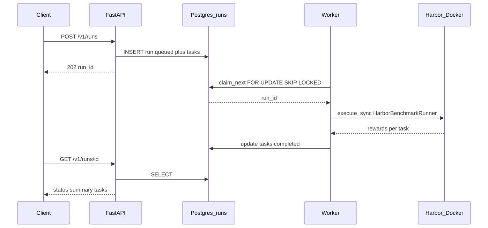
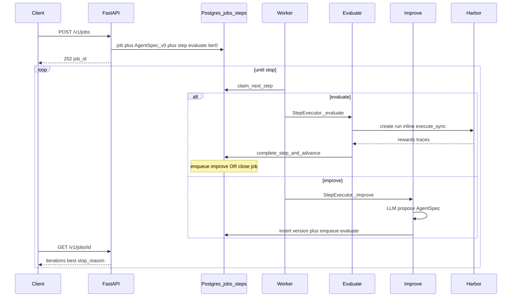

# Architecture

This document describes the **HTTP service layer** built on top of the CLI auto-harness: one-shot Terminal-Bench runs (Milestones 1–3) and the iterative optimization loop (Milestone 4).

Diagram sources live in [`diagrams/`](diagrams/) (`.mmd` + rendered `.svg` / `.png`).

---

## 1. System overview



| Layer | Responsibility |
|-------|----------------|
| **FastAPI** | Accept work, validate, persist, return status. Never runs Harbor. |
| **PostgreSQL** | Job/run queue (`FOR UPDATE SKIP LOCKED`) + results. |
| **Worker** | Claims **steps** first (M4), then legacy **runs** (M1–M3). |
| **Harbor** | Host CLI: load agent, create sandboxes, collect rewards. |
| **Docker / E2B** | Isolated task environments + deterministic verifier (default: **E2B** via Harbor `--env`). |
| **Artifacts** | Traces and improver I/O on local disk. |

---

## 2. One-shot benchmark (`POST /v1/runs`)



1. API inserts a `queued` run + `run_tasks`.
2. Worker claims the run and calls `HarborBenchmarkRunner.execute_sync`.
3. Harbor runs `agent.agent:HarnessAgent` (mutable `agent/agent.py`) against the task subset.
4. Rewards land in Postgres; client polls `GET /v1/runs/{id}`.

Use this for a single eval of the repo agent file. No improver.

---

## 3. Iterative job loop (`POST /v1/jobs`)



1. API creates a **job**, **AgentSpec v0** (baseline prompt/config), and step `evaluate` at iteration 0.
2. Worker claims typed **steps** (`evaluate` | `improve`).
3. Evaluate runs Harbor **inline** (creates a pre-claimed run row — not a second queue hop).
4. Improve calls an LLM to propose a new `AgentSpec`, then enqueues the next evaluate.
5. Loop stops on max iterations, patience (no improvement), wall-clock budget, or improve failure.

Poll `GET /v1/jobs/{id}`; best agent via `GET /v1/jobs/{id}/best`.

---

## 4. Evaluate step (detail)



- Materialize `workspace/runs/{run_id}/agent_spec.json`.
- Run Harbor with `agent.spec_agent:HarnessAgent` + `HARNESS_AGENT_SPEC` + `HARNESS_SAVE_TRACE=1`.
- Map rewards → `run_tasks`; copy `trace.json` into the artifact store.
- Score = mean reward (`None` counts as 0).
- Transactionally complete the step and either enqueue **improve** (from **best** version) or close the job.

---

## 5. Improve step (detail)



- Context: best `AgentSpec`, compact iteration history, latest failures + trace tails (character budget).
- `LLMImprover` proposes a new spec (prompt + limited config fields); validated with Pydantic.
- Persist `prompt.txt` / `response.json`; insert `agent_versions` N+1; enqueue next evaluate.

The service **never** edits `agent/agent.py`. Specs live in Postgres JSONB.

---

## 6. Data model



| Table | Role |
|-------|------|
| `runs` / `run_tasks` | One Harbor execution and per-task outcomes (M1–M4). |
| `jobs` | Optimization job config, best score, stop reason. |
| `agent_versions` | Immutable AgentSpec snapshots per job. |
| `steps` | Queue units: `evaluate` / `improve`. |

---

## 7. Where code runs



| Concern | Location |
|---------|----------|
| API + worker + Harbor CLI + agent LLM loop | **Host** |
| Bash tools + verifier | **E2B** by default (or Docker/Daytona/Modal via Harbor `--env` / `ENV_PROVIDER`) |
| Improver LLM | **Host** (between Harbor runs) |

Scoring is the Terminal-Bench **verifier**, not an LLM judge.

### Harbor + E2B smoke

Default `env_provider` is `e2b`. Task sandboxes do not need local Docker/Colima; Postgres still does.

1. Put `E2B_API_KEY` and `OPENAI_API_KEY` in repo `.env` (API/worker load it on startup).
2. `docker compose up -d postgres`
3. `uvicorn api.main:app --port 8000`
4. `EXECUTION_BACKEND=harbor python -m worker.main -v`
5. `python test_client.py --mode run --task-ids fix-git --timeout 1800`

Expect: Harbor trial dirs under `workspace/runs/<run_id>/`, rewards on `GET /v1/runs/{id}`. Override provider with `ENV_PROVIDER=docker` if you need local Docker instead.

---

## 8. Artifacts on disk



```
workspace/runs/{run_id}/           # Harbor job output + agent_spec.json
workspace/artifacts/jobs/{job_id}/iterations/{n}/
  tasks/{task_id}/trace.json
  improver/prompt.txt
  improver/response.json
```

---

## 9. Worker claim order

```text
1. claim_next_step()   → M4 evaluate / improve
2. claim_next()        → legacy M1–M3 /v1/runs
```

One worker binary serves both APIs.

---

## 10. Stopping (after each evaluate)

1. `iteration + 1 >= max_iterations` → `max_iterations`
2. Non-improving streak `>= patience` and past `min_iterations` → `no_improvement`
3. Wall clock `> max_job_duration_sec` → `budget_exceeded`

Improvement: `score > best_score + min_delta`. Defaults in [`config/benchmark.yaml`](../../config/benchmark.yaml).

---

## Regenerating diagrams

```bash
cd docs/architecture/diagrams
for f in *.mmd; do
  npx --yes @mermaid-js/mermaid-cli -i "$f" -o "${f%.mmd}.svg" -b transparent
  npx --yes @mermaid-js/mermaid-cli -i "$f" -o "${f%.mmd}.png" -b white -s 2
done
```

---

## Related docs

- Design: [`../superpowers/specs/2026-09-02-milestone-4-iterative-loop-design.md`](../superpowers/specs/2026-09-02-milestone-4-iterative-loop-design.md)
- Plan: [`../superpowers/plans/2026-09-02-milestone-4-iterative-loop.md`](../superpowers/plans/2026-09-02-milestone-4-iterative-loop.md)
