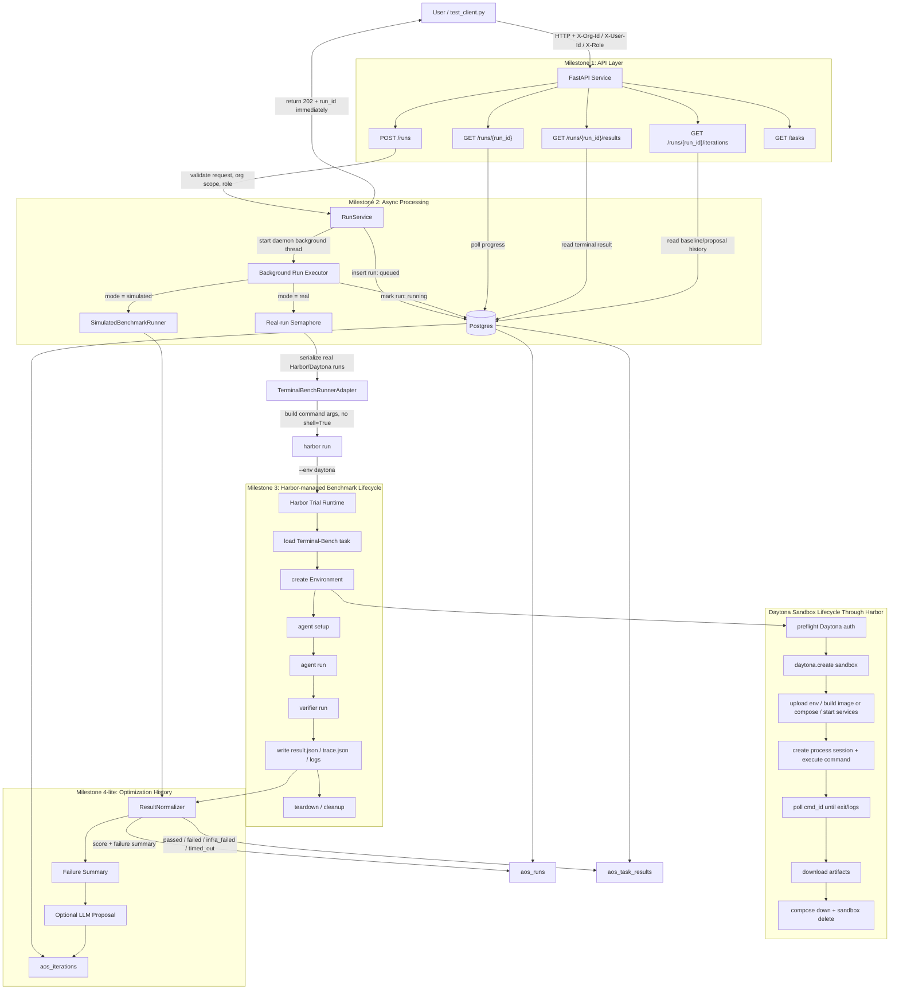

# Agent Optimization Service MVP System Design

This diagram shows how the MVP satisfies the take-home milestones:

- Milestone 1: HTTP API with structured run, status, result, and iteration resources.
- Milestone 2: asynchronous job lifecycle with polling.
- Milestone 3: real sandbox execution through Harbor and Daytona.
- Milestone 4-lite: persisted iteration history and optional LLM improvement proposal.
- Milestone 5-lite: API-level org/user/role scoping through demo headers.

## Request Flow

The user enters the system only through HTTP. A run is created with `POST /runs`.
The API validates task IDs, mode, sandbox provider, org scope, and role. It writes
a queued run to Postgres and returns `202 Accepted` with a `run_id` immediately.
The user then polls `GET /runs/{run_id}` and reads terminal output through
`GET /runs/{run_id}/results`.

## Async Harbor Flow

The API process starts a background executor for the submitted run. In simulated
mode, the executor uses deterministic fake rewards so reviewers can validate the
API lifecycle without external credentials. In real mode, the executor calls
`TerminalBenchRunnerAdapter`, which invokes `harbor run --env daytona` through
argument lists, not `shell=True`.

Real Harbor/Daytona runs are serialized in the MVP with a process-local semaphore.
This keeps the one-day version simple and avoids shared artifact races and
Daytona quota spikes. A production version would replace this with a durable queue,
worker leases, heartbeats, and reconciliation.

## Daytona Lifecycle Boundary

Our service does not call the Daytona SDK directly. Harbor owns the Daytona-facing
lifecycle for the benchmark trial:

1. Check Daytona credentials.
2. Create the sandbox.
3. Upload environment files and build/start the task environment.
4. Execute agent and verifier commands through Daytona process sessions.
5. Poll command status and collect logs.
6. Download result and trace artifacts.
7. Tear down compose services and delete the sandbox.

This is why the MVP treats Harbor as the sandbox adapter. Daytona provides the
isolated execution substrate; Harbor adds benchmark semantics, task setup,
verification, artifact collection, timeout handling, and cleanup.
